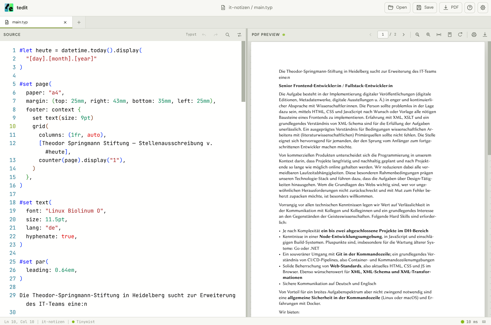

# tedit

<p align="center">
  
</p>



A focused desktop editor for [Typst](https://typst.app/) with Monaco editing,
Tinymist diagnostics, an incremental live preview, and bundled offline documentation.

*This App is 100% vibe coded for my own personal/business purposes. It just puts together already existing pieces: electron, typst, tinymist, and the Monaco editor. Even though there are Installers and distributions for multiple OS, it is still intended to be for my personal use only, which means no support or guarantees are given.*

## Features

- Monaco editor with Typst syntax support, folding, diagnostics, Find/Replace,
  Undo/Redo, and optional Vim bindings
- native Tinymist backend for in-memory PDF compilation and language-server
  diagnostics
- incremental multi-page Tinymist SVG preview with selectable text, zoom, page
  navigation, printing, and PDF downloads
- bidirectional source/preview navigation and automatic scrolling, including
  untitled documents
- draggable document tabs, session restoration, and repository metadata
- bundled, searchable Typst documentation that works offline
- persistent dark/light themes and editor settings
- Linux, Windows, Intel macOS, and Apple Silicon macOS release artifacts

## Downloads

Installers and SHA-256 checksums are published on the
[GitHub Releases](https://github.com/Simon-Martens/tedit/releases) page.

Release builds download Tinymist `0.15.2`, which embeds Typst `0.15.0`, on
first use when no compatible local binary exists. Matching Typst `0.15.0`
documentation remains bundled. The Windows installer is unsigned. macOS builds
are ad-hoc signed so their native executables can run on Apple Silicon, but are
not notarized. Both platforms may show operating-system security warnings.

## Architecture

tedit is an Electron and React application. Tinymist is the native Typst
backend for compilation, diagnostics, and the visible preview. The editor sends
unsaved source through memory-file updates, and Tinymist streams incremental
vector updates that are patched into a persistent SVG document. Preview clicks
are resolved back to Monaco source ranges through Tinymist.

The long-lived Tinymist LSP process still exports PDF bytes for printing and
downloads. Untitled documents receive an application-managed temporary path so
the preview sidecar can synchronize them without requiring an explicit save.

Tinymist is resolved in this order:

1. `TINYMIST_PATH`
2. a compatible `tinymist` executable on `PATH`
3. the versioned per-user download cache
4. a verified download from the configured GitHub release

tedit accepts only a Tinymist binary that embeds the configured Typst version.
Downloaded archives are checked against SHA-256 hashes pinned in the app and
are never included in tedit installers.

## Run Locally

Requirements:

- Node.js 24
- npm
- Rust stable and Cargo for building offline documentation
- Inkscape and ImageMagick only when regenerating application icons

Install dependencies:

```sh
npm install
```

Verify that all configured Tinymist release assets still match their pinned
checksums:

```sh
npm run verify-tinymist-release
```

Build the offline documentation from a Typst `v0.15.0` checkout:

```sh
npm run package-docs -- /path/to/typst-v0.15.0
```

The path defaults to `../typst` and can also be supplied through
`TYPST_SOURCE_DIR`. The first documentation build can take several minutes and
multiple gigabytes of disk space.

Start Vite and Electron:

```sh
npm run dev
```

## Build

Validate the renderer production build:

```sh
npm run build
```

Build documentation, compile the renderer, and create a host-platform installer:

```sh
npm run dist
```

Generated installers are written to `release/`.

## Application Icons

`tedit.svg` is the editable icon source. After changing it, regenerate the
path-only SVG, PNG, and Windows ICO assets:

```sh
npm run generate-icons
```

Generated assets are written to `build/` and should be committed together with
the source SVG.

## Releases

Tags matching `v*` trigger the GitHub Actions release workflow. It builds the
offline documentation once, creates four platform installers, generates
checksums, and publishes a GitHub prerelease.

See [docs/deployment.md](docs/deployment.md) for the complete preparation,
validation, tagging, publication, verification, and recovery procedure.
